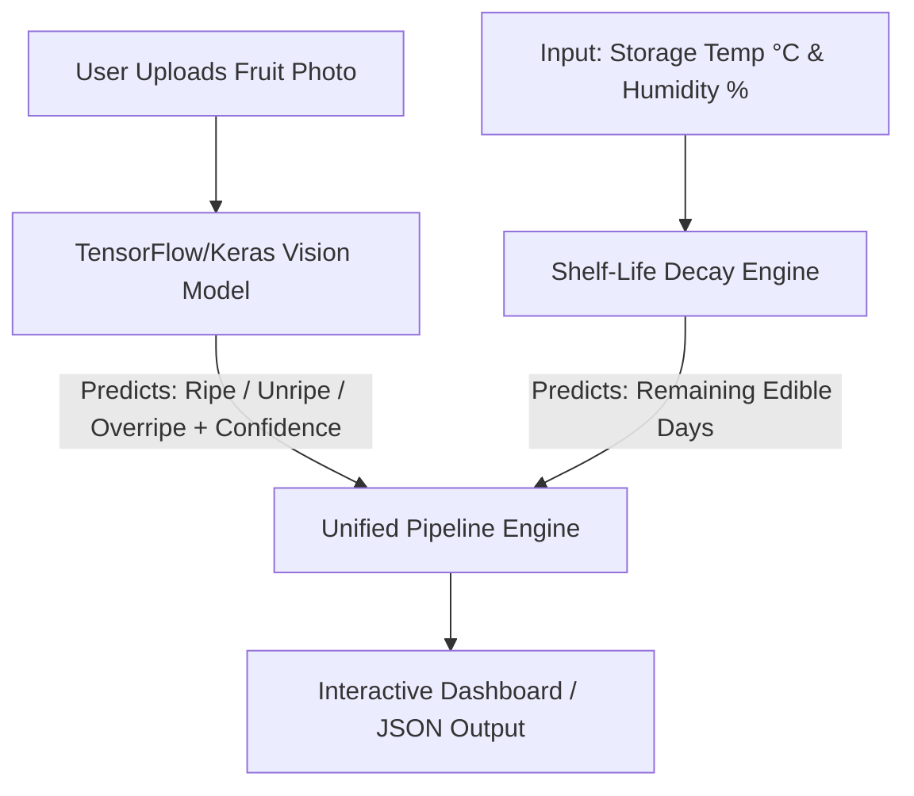

# 🍏 Fruit Ripeness & Shelf-Life Predictor

An AI-powered computer vision and tabular machine learning system that evaluates fruit ripeness from photos and estimates remaining edible shelf-life based on environmental storage conditions.

---

## 🏗 Architecture Overview

The system operates in a two-stage pipeline:



### Module Breakdown
1. **Visual Ripeness Classifier (TensorFlow / Keras):**
   * Pretrained CNN backbone (`tf.keras.applications.MobileNetV2` / `ResNet50V2`) fine-tuned on fruit ripeness datasets.
   * Classifies images into ripeness stages: `Unripe`, `Ripe`, `Overripe`.
2. **Shelf-Life Decay Estimator (Tabular ML):**
   * Regression model (`XGBoost` or `Scikit-Learn RandomForestRegressor`).
   * Predicts remaining edible days based on `ripeness_stage`, `storage_temp_c`, and `humidity_pct`.
3. **User Interface / Pipeline:**
   * Streamlit dashboard to upload images, set environmental parameters, and visualize shelf-life predictions.

---

## 🛠 Tech Stack

* **Deep Learning:** TensorFlow 2.x, Keras (`tf.keras.applications`)
* **Machine Learning:** XGBoost, Scikit-Learn, Pandas, NumPy
* **Computer Vision:** OpenCV, Pillow
* **Web UI:** Streamlit

---

## 🗂 Project Structure

```text
Fruit-Ripeness-Predictor/
├── README.md                # Project documentation & architecture overview
├── requirements.txt         # Project dependencies
├── models/                  # Local directory for saved model weights (ignored by git)
│   ├── tf_ripeness_model.keras
│   └── shelflife_regressor.pkl
├── Train/                   # Local image dataset (ignored by git)
│   ├── Overipe/
│   ├── Ripe/
│   └── Unripe/
└── src/                     # Source code directory
    ├── train_classifier.py
    ├── train_regressor.py
    └── predictor.py
```

---

## 🚀 Quick Start

1. **Install Dependencies:**
   ```bash
   pip install -r requirements.txt
   ```

2. **Dataset Setup:**
   Place your image dataset into the `Train/` directory structured by class folders (`Train/Unripe`, `Train/Ripe`, `Train/Overripe`).