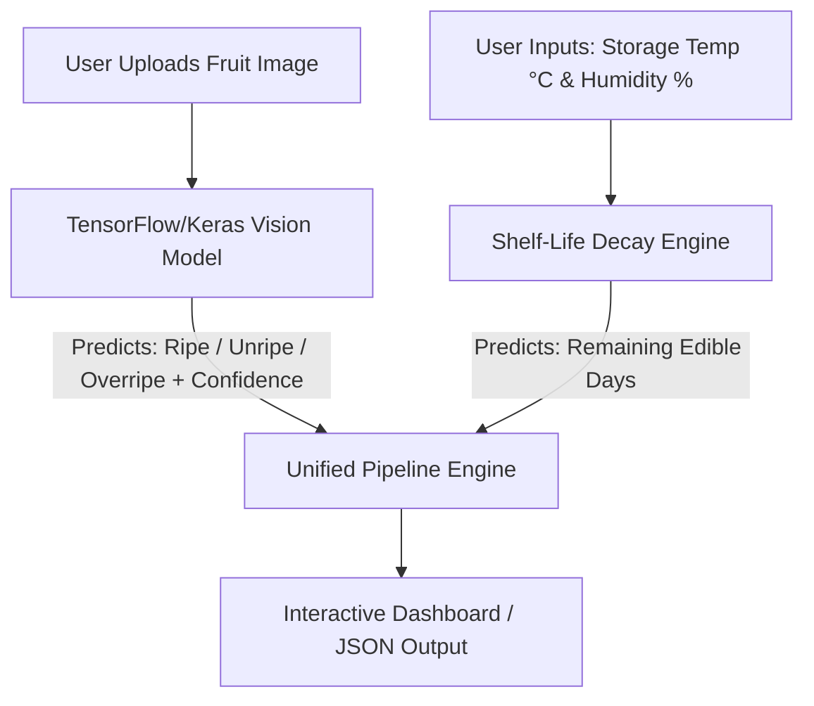

# 🍏 Fruit Ripeness & Shelf-Life Predictor (Solo Plan)
## Technical Implementation Plan — TensorFlow / Keras Stack

---

## 📌 1. Project Concept & Architecture

The **Fruit Ripeness & Shelf-Life Predictor** is an AI application that evaluates fruit quality visually and predicts how many days of edible life remain under specific storage conditions.



### System Architecture Breakdown
1. **Module 1: Visual Ripeness Classifier (TensorFlow / Keras)**
   * **Input:** Image of fruit (`224x224 RGB`).
   * **Backbone:** Pretrained `tf.keras.applications.ResNet50V2` or `MobileNetV2` (Transfer Learning on ImageNet).
   * **Output:** Ripeness classification (`Unripe`, `Ripe`, `Overripe`) with confidence percentage.
2. **Module 2: Shelf-Life Estimator (Tabular ML / Decay Kinetics)**
   * **Input:** `ripeness_stage`, `storage_temp_c`, `humidity_pct`.
   * **Engine:** XGBoost or Scikit-Learn (`RandomForestRegressor` / `LinearRegression`).
   * **Output:** Remaining shelf-life in days (e.g., `4.2 days`).
3. **Module 3: Application Interface (Streamlit Dashboard / Python Script)**
   * Single interactive app to upload photos, adjust sliders for temp/humidity, and display results.

---

## ⏱ 2. Solo 1-Week Roadmap

Yes! This project is **100% doable in 1 week** (or even 2–3 days) as a solo project.

```text
[Day 1] ─── Environment Setup & Data Exploration (TensorFlow, Pandas)
[Day 2] ─── Train TensorFlow/Keras Ripeness Classifier (MobileNetV2 / ResNet50V2)
[Day 3] ─── Train Tabular Shelf-Life Regressor (XGBoost / Scikit-Learn)
[Day 4] ─── Build Joint Pipeline (Combine image predictions + tabular inputs)
[Day 5] ─── Build Streamlit App / UI
[Day 6] ─── Testing, Evaluation & Documentation
[Day 7] ─── Buffer & Final Presentation / GitHub Push
```

---

## 🛠 3. Tech Stack

* **Deep Learning Framework:** TensorFlow 2.x / `tf.keras`
* **Pretrained Models:** `tf.keras.applications.ResNet50V2` or `tf.keras.applications.MobileNetV2`
* **Tabular ML Framework:** XGBoost / Scikit-Learn (`RandomForestRegressor`)
* **Data Handling:** Pandas, NumPy, Pillow, OpenCV
* **User Interface:** Streamlit (Easy interactive Python UI)

---

## 🗂 4. Project Directory Structure

```text
Fruit-Ripeness-Predictor/
├── .gitignore               # Excludes Train/, Test/, models/, *.h5, *.keras
├── implementation_plan.md    # Solo developer technical plan
├── README.md                # Project summary & setup instructions
├── requirements.txt         # Dependencies (tensorflow, xgboost, streamlit, pandas)
├── models/                  # Local directory for saved model weights
│   ├── tf_ripeness_model.keras
│   └── shelflife_regressor.pkl
└── src/                     # Folder for your Python scripts (to be written by you)
    ├── train_classifier.py
    ├── train_regressor.py
    └── predictor.py
```

---

## 🤝 5. Unified Data Contract Schema

```json
{
  "status": "success",
  "ripeness_analysis": {
    "fruit_type": "Banana",
    "ripeness_stage": "Unripe",
    "confidence": 0.95
  },
  "preservation_estimate": {
    "storage_temp_c": 22.0,
    "humidity_pct": 60.0,
    "remaining_shelf_life_days": 4.5
  }
}
```

---

## 🚀 6. Next Steps

1. Install dependencies via `pip install -r requirements.txt`.
2. Start writing your TensorFlow training script in `src/train_classifier.py`.
