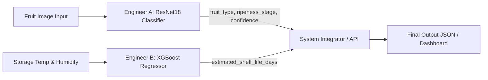

# 🍏 Fruit Ripeness Predictor & Shelf-Life Estimation System
## Technical Implementation Plan

---

## 📌 1. Project Overview & Team Roles

This project combines **Computer Vision (Visual Analysis)** with **Tabular Machine Learning (Decay Kinetics)** to classify fruit ripeness from images and estimate remaining edible shelf-life based on environmental conditions.



### Roles Breakdown
* **Engineer A — Ripeness Classifier (Computer Vision)**
  * **Frameworks:** PyTorch, Torchvision
  * **Architecture:** ResNet18 (Transfer Learning)
  * **Task:** Extract visual features (skin color, texture, spots) to predict `fruit_type` and `ripeness_stage` (`Unripe`, `Ripe`, `Overripe`).
* **Engineer B — Shelf-Life Regressor (Tabular & Decay Kinetics)**
  * **Frameworks:** XGBoost, Scikit-Learn, Pandas
  * **Task:** Predict remaining shelf-life in days using `ripeness_stage`, `storage_temp_c`, and `humidity_pct`.

---

## 📦 2. Dataset & Git Strategy

### 🚫 Why Datasets are `.gitignore`d (Not tracked in Git or Git LFS)
1. **GitHub Limits:** Repositories and Git LFS free tiers have strict quota limits (1 GB LFS storage/bandwidth).
2. **Speed & Cleanliness:** Tracking thousands of raw image files slows down `git clone`, `git status`, and `git push`.
3. **Best Practice:** Keep dataset binaries out of Git. Share dataset download links or use a local setup script.

### 🗂 Data Directory Structure (Local Only)
```text
Fruit-Ripeness-Predictor/
├── .gitignore               # Configured to ignore Train/, Test/, *.pth, etc.
├── implementation_plan.md    # Technical implementation plan
├── README.md
├── requirements.txt         # Shared Python dependencies
├── src/
│   ├── classifier/          # Engineer A codebase
│   │   ├── dataset.py
│   │   ├── train.py
│   │   └── predict.py
│   ├── regressor/           # Engineer B codebase
│   │   ├── train_regressor.py
│   │   └── predict_decay.py
│   └── pipeline.py          # Joint integration pipeline
├── models/                  # Local directory for trained weights (ignored by git)
│   ├── resnet18_ripeness.pth
│   └── xgboost_shelflife.json
└── Train/                   # Local raw dataset (ignored by git)
    ├── Overipe/
    ├── Ripe/
    └── Unripe/
```

---

## 🤝 3. Data Contracts & Integration API

### Contract A: Engineer A Output Schema
```json
{
  "fruit_type": "Banana",
  "ripeness_stage": "Unripe",
  "confidence": 0.94
}
```

### Contract B: Engineer B Input Schema
```json
{
  "fruit_type": "Banana",
  "ripeness_stage": "Unripe",
  "storage_temp_c": 22.0,
  "humidity_pct": 65.0
}
```

### Unified System Output Schema
```json
{
  "status": "success",
  "classification": {
    "fruit_type": "Banana",
    "ripeness_stage": "Unripe",
    "confidence": 0.94
  },
  "preservation": {
    "storage_temp_c": 22.0,
    "humidity_pct": 65.0,
    "estimated_shelf_life_days": 4.2
  }
}
```

---

## 📅 4. Implementation Phases & Timeline

### Phase 1: Environment Setup & Data Verification (Day 1)
- [x] Configure `.gitignore` to exclude large image datasets and model weights.
- [x] Create `implementation_plan.md` for team alignment.
- [ ] Create `requirements.txt` with PyTorch, torchvision, xgboost, scikit-learn, pandas, opencv-python, and pillow.
- [ ] Engineer A: Verify image dataset classes (`Train/Unripe`, `Train/Ripe`, `Train/Overripe`).
- [ ] Engineer B: Prepare/simulate decay kinetics tabular dataset (`fruit_type`, `ripeness_stage`, `temp`, `humidity`, `days_left`).

### Phase 2: Independent Model Development (Days 1–2)
- **Engineer A:**
  - Build PyTorch Dataset & DataLoader with augmentations (`Resizing 224x224`, `RandomHorizontalFlip`, `ColorJitter`, `Normalize`).
  - Train ResNet18 model using transfer learning (`weights=ResNet18_Weights.DEFAULT`).
  - Save best checkpoint to `models/resnet18_ripeness.pth`.
- **Engineer B:**
  - Build feature pipeline (One-Hot Encoding for categorical features, StandardScaler for numerical inputs).
  - Train `XGBRegressor` to predict `remaining_days`.
  - Save model to `models/xgboost_shelflife.json`.

### Phase 3: System Integration & Inference Pipeline (Day 3)
- Create `src/pipeline.py` to ingest an image + environmental metrics and output the unified JSON response.
- Evaluate end-to-end performance and edge-case handling.

---

## 🛠 5. Immediate Next Actions

1. **Engineer A:** Run the training script setup to fine-tune ResNet18 on the dataset.
2. **Engineer B:** Set up the tabular decay dataset and build the XGBoost regression baseline.
3. Commit and push code updates (`.gitignore`, `implementation_plan.md`, `requirements.txt`, source code) to GitHub.
